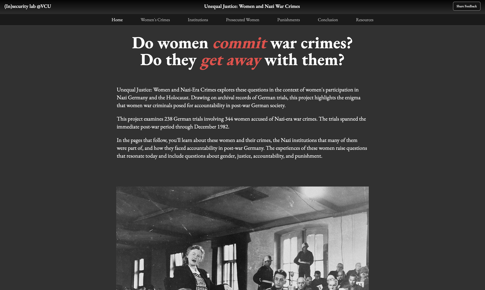
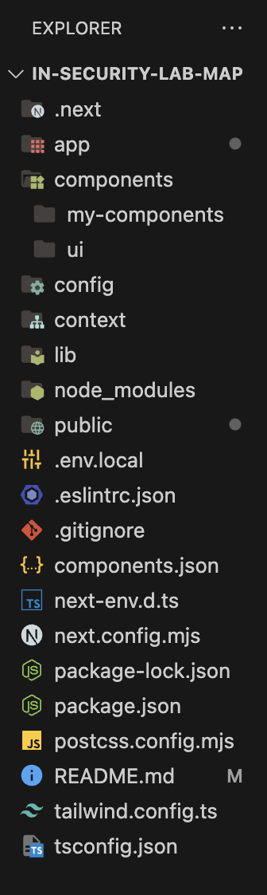

<h1 align="center">Insecurity Lab Map Repo Documentation</h1>
<p align="center">
  by <a href="https://www.nanakofiokae.com">Nana Kofi Okae (2024-2025) </a>
</p>

<p align="center">
  
</p>

# Getting started.

1. **Fork This Repository**:

- Click the "Fork" button at the top right of this page to create a copy under your GitHub account.

2. **Clone Your Fork Repo and chenage the directory**:

```bash
 git clone https://github.com/your-username/your-forked-repo.git
 cd your-forked-repo
```

3. **Run this command to install all dependencies needed for the project**:

```bash
   npm install
```

4. **Run the development server**:

```bash
npm run dev
# or
yarn dev
# or
pnpm dev
# or
bun dev
```

5. **Open [http://localhost:3000](http://localhost:3000) with your browser to see the result.**:

**_P.S. When developing and making changes, it's best practice to create a new branch for your work and submit a pull request for review before merging it into the main (or prod) branch. This ensures better collaboration, code quality, and minimizes the risk of introducing errors into production._**

# Navigating this project.

<p>
  ⭐️ These are the folders/files you will mainly focus on, but  not limited to just them to complete the project; you can add more based on the future requirements. 
</p>

## App folder

<details>
<summary><code>api/mapbox/routes.ts</code></summary>

```typescript
import { NextResponse } from "next/server";

export async function GET(request: Request) {
  const { searchParams } = new URL(request.url);
  const endpoint = searchParams.get("endpoint");

  const mapboxToken = process.env.MAPBOX_ACCESS_TOKEN;
  const mapboxStyle = process.env.MAPBOX_STYLE;
  const crimesURL = process.env.CRIMES_URL;
  const crimesSources = process.env.CRIMES_SOURCES;

  if (!mapboxToken || !mapboxStyle || !crimesURL || !crimesSources) {
    return NextResponse.json(
      { error: "Environment variables are missing." },
      { status: 500 }
    );
  }

  switch (endpoint) {
    case "crimes":
      return NextResponse.json({
        token: mapboxToken,
        style: mapboxStyle,
        url: crimesURL,
        sources: crimesSources,
      });
    default:
      return NextResponse.json({ error: "Invalid endpoint." }, { status: 400 });
  }
}
```

</details>

- This makes a request to get the api when its called from mapbox, if the request is made and the variables are not in, it will return an error. Please ask the professor for the environmental variables file in order for the request to be properly made and valid.

<details>
<summary><code>conclusion/page.tsx</code></summary>

```typescript
import React from "react";

export default function ConclusionPage() {
  return (
    <div className="w-full max-w-4xl mx-auto py-4 min-h-[75vh]">
      <h1 className="text-4xl font-bold mb-6">Conclusion</h1>
      <div className="flex flex-col gap-12">
        <p className="text-lg md:text-xl">
          Many of these women were everyday people. A couple became infamous,
          but many were released from prison and returned to normal life. They
          returned to families, to boring jobs, to their old beds. Others died
          in prison or had their civil rights and assets removed by the state.
          Many more women evaded justice. Some were punished at the people’s
          hands. So, what does a war criminal look like? And what does it take
          to be one? Moreover, what does justice look like?
        </p>
      </div>
    </div>
  );
}
```

</details>

- This component contains all the content for the conclusion page

<details>
<summary><code>crimes/page.tsx</code></summary>

```typescript
"use client";

import CrimesMap from "@/components/my-components/crimes-map";
import { Button } from "@/components/ui/button";
import { X } from "lucide-react";
import React, { useState } from "react";
import {
  Table,
  TableBody,
  TableCell,
  TableHead,
  TableHeader,
  TableRow,
} from "@/components/ui/table";

export default function CrimesPage() {
  const [selectedFeature, setSelectedFeature] = useState<{
    [key: string]: string | number;
  } | null>(null);

  const excludedFields = [
    "GeoLocation of Trial",
    "GeoLocation of Crime",
    "Latitude",
    "Longitude",
    "ID",
    "Defendant Name",
  ];
  return (
    <div className="grid grid-cols-2 max-lg:grid-cols-1 lg:gap-4 gap-8  w-full">
      <div className=" content-container w-full py-4 ">
        <h1 className="text-3xl font-bold mb-4">Women’s Crimes Map</h1>
        {selectedFeature ? (
          <>
            <div className="w-full flex justify-between items-center">
              <h2 className="text-2xl font-medium text-red-500 mb-2">
                <span className="font-normal text-white">
                  Case details for{" "}
                </span>
                {selectedFeature["Defendant Name"]}
              </h2>
              <Button
                onClick={() => setSelectedFeature(null)}
                size="icon"
                variant="outline"
              >
                <X size={15} className="text-black" />
              </Button>
            </div>

            <Table className="border mt-6">
              <TableHeader className="font-bold bg-neutral-900">
                <TableRow>
                  <TableHead>Field</TableHead>
                  <TableHead>Value</TableHead>
                </TableRow>
              </TableHeader>
              <TableBody>
                {Object.entries(selectedFeature)
                  .filter(([key]) => !excludedFields.includes(key))
                  .map(([key, value]) => (
                    <TableRow key={key}>
                      <TableCell className="">{key}</TableCell>
                      <TableCell>{value}</TableCell>
                    </TableRow>
                  ))}
              </TableBody>
            </Table>
          </>
        ) : (
          <div className="text-lg md:text-xl">
            <p className="mb-4 ">
              This project documents the 344 women prosecuted in Germany for
              Nazi-era crimes. At the time of their trials, the accused women
              ranged in age from 18 to 78 years old. Roughly half were married.
              Of the rest, about 14 percent were unmarried, 7 percent were
              divorced, and 9 percent widowed. More than 15 percent of the
              accused were mothers. Court records indicate that some had as many
              as eight children, though most had one or two. Although some were
              housewives, many of the women worked in a range of fields,
              including as doctors, nurses, and concentration camp guards.
            </p>
            <p>
              This map illustrates the towns and cities where these women
              allegedly committed their crimes. Each point provides biographical
              information about the accused, such as their age and marital
              status, as well as some information about their victims.
            </p>
          </div>
        )}
      </div>
      <div className="w-full  lg:py-4 lg:h-[50rem]  max-lg:aspect-square mb-10 ">
        <CrimesMap onFeatureClick={setSelectedFeature} />
      </div>
    </div>
  );
}
```

</details>

- This component contains all the content for the crimes page. This page is one out of 3 pages that will have a map with data. I was able to get the crimes data to function, but ran into some issues with the other 2. You can use this file as a blueprint to help with the other 2 in terms of api calls, data and map visualization. 


<details>
<summary><code>poi/page.tsx</code></summary>

```typescript
"use client";

import React from "react";

export default function PoiPage() {
  return (
    <div className="flex flex-col md:flex-row h-full">
      <div className="w-full  py-4 overflow-auto">
        <h1 className="text-2xl font-bold mb-4">Points of Interest</h1>
        <p className="mb-4">
          This page contains information about various points of interest
          related to Nazi war crimes.
        </p>
      </div>
    </div>
  );
}

```

</details>

- This component contains all the content for the poi page. The map and the table have not been implemented yet. 

<details>
<summary><code>punishments/page.tsx</code></summary>

```typescript

import React from "react";
import { PunishmentTerms, punishment } from "@/config/punishments";

export default function PunishmentsPage() {
  return (
    <div className="w-full max-w-4xl mx-auto py-4 min-h-[75vh]">
      <h1 className="text-4xl font-bold mb-6">Punishments</h1>
      <div className="flex flex-col gap-12">
        {punishment.map((term: PunishmentTerms, index) => (
          <div key={index}>
            <h3 className="font-bold underline text-lg lg:text-xl mt-4">
              {term.name}
            </h3>
            <p className="text-lg lg:text-xl">{term.definition}</p>
          </div>
        ))}
      </div>
    </div>
  );
}

```

</details>

- This component contains all the content for the punishment page. The data is being mapped through an array that can be found in the config folder. 


<details>
<summary><code>resources/page.tsx</code></summary>

```typescript

import Link from "next/link";
import React from "react";
import {
  ArchiveImage,
  archives,
  HeadShavingImages,
  headShaving,
  victims,
  VictimImages,
  Perpetrators,
  perps,
  context,
  ContextImages,
  article,
  Articles,
  camp,
  Camps,
} from "@/config/archive-images-links";

export default function Resources() {
  return (
    <div className="w-full min-h-screen py-4 flex flex-col items-center ">
      <div className="max-w-4xl flex flex-col items-center">
        <h1 className="text-3xl font-bold">Resources</h1>
        <h2 className="font-semibold text-xl mt-4">
          USHMM Archives - Public Domain
        </h2>

        <div className="flex flex-col gap-16 ">
          <ul className="list-disc ml-4 flex flex-col gap-8 mt-12 ">
            {archives.map((links: ArchiveImage, index: number) => (
              <li key={index}>
                <Link
                  href={links.href}
                  target="_blank"
                  className="hover:underline  transition-all duration-100 hover:text-neutral-200 flex text-lg md:text-xl"
                >
                  {links.name}
                </Link>
              </li>
            ))}
          </ul>

          <div className="w-full">
            <h2 className="font-bold text-lg underline">Head Shaving Images</h2>
            <ul className=" list-disc ml-4 flex flex-col gap-8 mt-4 ">
              {headShaving.map((links: HeadShavingImages, index: number) => (
                <li key={index}>
                  <Link
                    href={links.href}
                    target="_blank"
                    className="hover:underline  transition-all duration-100 hover:text-neutral-200 text-lg md:text-xl"
                  >
                    {links.name}
                  </Link>
                </li>
              ))}
            </ul>
          </div>
          <div className="w-full">
            <h2 className="font-bold text-lg underline">Victims</h2>
            <ul className="list-disc  ml-4 flex flex-col gap-8 mt-4 ">
              {victims.map((links: VictimImages, index: number) => (
                <li key={index}>
                  <Link
                    href={links.href}
                    target="_blank"
                    className="hover:underline  transition-all duration-100 hover:text-neutral-200 text-lg md:text-xl"
                  >
                    {links.name}
                  </Link>
                </li>
              ))}
            </ul>
          </div>
          <div className="w-full">
            <h2 className="font-bold text-lg underline">Perpetrators</h2>
            <ul className="list-disc ml-4 flex flex-col gap-8 mt-4 ">
              {perps.map((links: Perpetrators, index: number) => (
                <li key={index}>
                  <Link
                    href={links.href}
                    target="_blank"
                    className="hover:underline  transition-all duration-100 hover:text-neutral-200 text-lg md:text-xl"
                  >
                    {links.name}
                  </Link>
                </li>
              ))}
            </ul>
          </div>
          <div className="w-full">
            <h2 className="font-bold text-lg underline">Context</h2>
            <ul className="list-disc ml-4 flex flex-col gap-8 mt-4 ">
              {context.map((links: ContextImages, index: number) => (
                <li key={index}>
                  <Link
                    href={links.href}
                    target="_blank"
                    className="hover:underline  transition-all duration-100 hover:text-neutral-200 text-lg md:text-xl"
                  >
                    {links.name}
                  </Link>
                </li>
              ))}
            </ul>
          </div>
          <div className="w-full">
            <h2 className="font-bold text-lg underline">
              Concentration camp maps
            </h2>
            <ul className="list-disc ml-4 flex flex-col gap-8 mt-4 ">
              {camp.map((links: Camps, index: number) => (
                <li key={index}>
                  <Link
                    href={links.href}
                    target="_blank"
                    className="hover:underline  transition-all duration-100 hover:text-neutral-200 text-lg md:text-xl"
                  >
                    {links.name}
                  </Link>
                </li>
              ))}
            </ul>
          </div>
          <div className="w-full">
            <h2 className="font-bold text-lg underline">Articles</h2>
            <ul className="list-disc ml-4 flex flex-col gap-8 mt-4 ">
              {article.map((links: Articles, index: number) => (
                <li key={index}>
                  <Link
                    href={links.href}
                    target="_blank"
                    className="transition-all duration-100 hover:text-neutral-200 text-lg md:text-xl"
                  >
                    {links.name}
                  </Link>
                </li>
              ))}
            </ul>
          </div>
        </div>
      </div>
    </div>
  );
}


```

</details>

- This component contains all the content for the resources page. The links are being mapped through an array that can be found in the config folder. 

<details>
<summary><code>trials/page.tsx</code></summary>

```typescript

"use client";

import React from "react";

export default function TrialsPage() {
  return (
    <div className="flex flex-col md:flex-row h-full">
      <div className="w-full  py-4 overflow-auto">
        <h1 className="text-2xl font-bold mb-4">Nazi War Crime Trials</h1>
        <p className="mb-4">
          This page contains information about various trials related to Nazi
          war crimes.
        </p>
      </div>
    </div>
  );
}


```

</details>

- This component contains all the content for the trials page. The map and the table have not been implemented yet. 

<details>
<summary><code>layout.tsx</code></summary>

```typescript
import type { Metadata } from "next";

import "./globals.css";
import Navbar from "@/components/my-components/navbar";
import Footer from "@/components/my-components/footer";

import { EB_Garamond } from "next/font/google";

const ebGaramond = EB_Garamond({
  subsets: ["latin"],
  weight: ["400", "500", "600", "700"],
  display: "swap",
});

export const metadata: Metadata = {
  title: "Unequal Justice: Women and Nazi-Era Crimes",
  description:
    "Explores these questions in the context of women's participation in Nazi Germany and the Holocaust.",
};

export default function RootLayout({
  children,
}: Readonly<{
  children: React.ReactNode;
}>) {
  return (
    <html lang="en">
      <body className={ebGaramond.className}>
        <Navbar />
        <main className="w-full h-full p-4 flex flex-col md:flex-row gap-2 mt-[95px] text-white mb-20">
          {children}
        </main>
        <Footer />
      </body>
    </html>
  );
}


```

</details>

- This component is where the layout of the entire website is manipulated, anything you do here will have an effect on every page you create or has been created. This page is also used for SEO.

<details>
<summary><code>layout.tsx</code></summary>

```typescript
"use client";

import Image from "next/image";
import React from "react";
import Link from "next/link";

export default function HomePage() {
  return (
    <section className="w-full">
      <div className="w-full  py-4 flex flex-col items-center">
        <h1 className="text-4xl md:text-6xl font-bold mb-6 max-w-[50rem] md:w-full text-center inline text-white">
          Do women <span className="italic text-red-500">commit</span> war
          crimes? Do they
          <span className="italic text-red-500"> get away</span> with them?
        </h1>

        <div className="text-lg md:text-xl mt-10 max-w-4xl w-full mb-4 flex flex-col gap-5 text-white">
          <p>
            Unequal Justice: Women and Nazi-Era Crimes explores these questions
            in the context of women&#39;s participation in Nazi Germany and the
            Holocaust. Drawing on archival records of German trials, this
            project highlights the enigma that women war criminals posed for
            accountability in post-war German society.
          </p>
          <p>
            This project examines 238 German trials involving 344 women accused
            of Nazi-era war crimes. The trials spanned the immediate post-war
            period through December 1982.
          </p>
          <p>
            In the pages that follow, you&#39;ll learn about these women and
            their crimes, the Nazi institutions that many of them were part of,
            and how they faced accountability in post-war Germany. The
            experiences of these women raise questions that resonate today and
            include questions about gender, justice, accountability, and
            punishment.
          </p>
        </div>
        <div className="w-full flex flex-col items-center mt-20  image-container">
          <Image
            src="/Ilse Koch.jpg"
            alt="Ilse Koch testifies in her own defense"
            width={900}
            height={900}
          />
          <Link
            href="https://collections.ushmm.org/search/catalog/pa1040530"
            className="text-white/95 text-center text-sm sm:text-md w-fit mt-2 hover:underline"
            target="_blank"
            rel="noopener noreferrer"
          >
            Ilse Koch testifies in her own defense at the trial of former camp
            personnel and prisoners from Buchenwald.
          </Link>
        </div>
      </div>
    </section>
  );
}


```

</details>

- This component is the landing page, where everyone lands on when the click the link. 


## Component folder

<details>
<summary><code>my-components/crimes-map.tsx</code></summary>

```typescript
"use client";

import React, { useEffect, useRef, useState, useCallback } from "react";
import mapboxgl from "mapbox-gl";
import "mapbox-gl/dist/mapbox-gl.css";

interface Feature {
  properties: {
    [key: string]: string | number;
  };
  geometry: {
    coordinates: [number, number];
  };
}

interface CrimesMapProps {
  onFeatureClick: (feature: Feature["properties"] | null) => void;
}

const CrimesMap: React.FC<CrimesMapProps> = ({ onFeatureClick }) => {
  const mapContainerRef = useRef<HTMLDivElement>(null);
  const mapRef = useRef<mapboxgl.Map | null>(null);
  const [mapLoaded, setMapLoaded] = useState(false);
  const [config, setConfig] = useState<{
    accessToken: string;
    style: string;
    crimesURL: string;
    crimesSource: string;
  } | null>(null);

  const fetchConfig = async () => {
    try {
      const response = await fetch("/api/mapbox?endpoint=crimes");
      if (!response.ok) throw new Error("Failed to fetch map configuration");
      const data = await response.json();
      setConfig({
        accessToken: data.token,
        style: data.style,
        crimesURL: data.url,
        crimesSource: data.sources,
      });
    } catch (error) {
      console.error("Error fetching configuration:", error);
    }
  };

  const addMapLayers = useCallback(
    (map: mapboxgl.Map) => {
      if (!config) return;

      map.addSource("crimes", {
        type: "vector",
        url: config.crimesURL,
      });

      map.addLayer({
        id: "crimes",
        type: "circle",
        source: "crimes",
        "source-layer": config.crimesSource,
        paint: {
          "circle-color": [
            "match",
            ["get", "Gender/Sex"],
            0,
            "#7F3121",
            1,
            "#FF69B4",
            "#CCCCCC",
          ],
          "circle-opacity": 0.75,
          "circle-radius": 5,
        },
      });

      map.addLayer({
        id: "crimes-labels",
        type: "symbol",
        source: "crimes",
        "source-layer": config.crimesSource,
        layout: {
          "text-field": ["get", "Defendant Name"],
          "text-size": 12,
          "text-anchor": "top",
          "text-offset": [0, 0.5],
          "text-font": ["DIN Offc Pro Medium", "Arial Unicode MS Bold"],
        },
        paint: {
          "text-color": "#000000",
          "text-halo-color": "#ffffff",
          "text-halo-width": 1,
        },
      });
    },
    [config]
  );

  const addClickEvents = useCallback(
    (map: mapboxgl.Map) => {
      map.on("click", "crimes", (e) => {
        if (e.features && e.features.length > 0) {
          const feature = e.features[0] as unknown as Feature;
          onFeatureClick(feature.properties);
        }
      });

      map.on("mouseenter", "crimes", () => {
        map.getCanvas().style.cursor = "pointer";
      });

      map.on("mouseleave", "crimes", () => {
        map.getCanvas().style.cursor = "";
      });
    },
    [onFeatureClick]
  );

  useEffect(() => {
    fetchConfig();
  }, []);

  useEffect(() => {
    if (!mapContainerRef.current || !config) return;

    mapboxgl.accessToken = config.accessToken;

    const map = new mapboxgl.Map({
      container: mapContainerRef.current,
      style: config.style,
      center: [10.4515, 51.1657],
      zoom: 5,
      projection: "mercator",
    });

    map.on("load", () => {
      addMapLayers(map);
      addClickEvents(map);
      mapRef.current = map;
      setMapLoaded(true);
    });

    return () => {
      map.remove();
    };
  }, [addMapLayers, addClickEvents, config]);

  return (
    <div
      className="rounded-lg "
      ref={mapContainerRef}
      style={{ height: "100%", width: "100%" }}
    />
  );
};

export default CrimesMap;


```

</details>

- This component is where we populate and help visualize all the crimes that the women commited and where. 

<details>
<summary><code>my-components/poi-map.tsx</code></summary>

```typescript
"use client"

import React, { useEffect, useRef, useState, useCallback } from "react"
import mapboxgl from "mapbox-gl"
// import config from "@/config/config"
import "mapbox-gl/dist/mapbox-gl.css"

// mapboxgl.accessToken = config.accessToken as string

interface Feature {
  properties: {
    [key: string]: string | number
  }
  geometry: {
    coordinates: [number, number]
  }
}

const PointsOfInterestMap: React.FC = () => {
  const mapContainerRef = useRef<HTMLDivElement>(null)
  const mapRef = useRef<mapboxgl.Map | null>(null)
  const [mapLoaded, setMapLoaded] = useState(false)

  const addMapLayers = useCallback((map: mapboxgl.Map) => {
    map.addSource("pointsOfInterest", {
      type: "vector",
      // url: config.interestURL,
    })

    map.addLayer({
      id: "pointsOfInterest",
      type: "circle",
      source: "pointsOfInterest",
      // "source-layer": config.interestSource,
      paint: {
        "circle-color": [
          "match",
          ["get", "Category"],
          "Labor Camp",
          "#7F3121",
          "Hospital",
          "#FF69B4",
          "Medical Institution",
          "#0000FF",
          "Concentration Camp",
          "#FF0000",
          "#CCCCCC",
        ],
        "circle-opacity": 0.75,
        "circle-radius": 5,
      },
    })

    map.addLayer({
      id: "poi-labels",
      type: "symbol",
      source: "pointsOfInterest",
      // "source-layer": config.interestSource,
      layout: {
        "text-field": ["get", "Name of Location"],
        "text-size": 12,
        "text-anchor": "top",
        "text-offset": [0, 0.5],
        "text-font": ["DIN Offc Pro Medium", "Arial Unicode MS Bold"],
      },
      paint: {
        "text-color": [
          "match",
          ["get", "Category"],
          "Labor Camp",
          "#7F3121",
          "Hospital",
          "#FF69B4",
          "Medical Institution",
          "#0000FF",
          "Concentration Camp",
          "#FF0000",
          "#CCCCCC",
        ],
      },
    })
  }, [])

  const addClickEvents = useCallback((map: mapboxgl.Map) => {
    map.on("click", "pointsOfInterest", (e) => {
      if (e.features && e.features.length > 0) {
        const feature = e.features[0] as unknown as Feature
        console.log("Clicked point of interest:", feature.properties)
      }
    })

    map.on("mouseenter", "pointsOfInterest", () => {
      map.getCanvas().style.cursor = "pointer"
    })

    map.on("mouseleave", "pointsOfInterest", () => {
      map.getCanvas().style.cursor = ""
    })
  }, [])

  useEffect(() => {
    if (!mapContainerRef.current) return
    const map = new mapboxgl.Map({
      container: mapContainerRef.current,
      // style: config.style as string,
      center: [10.4515, 51.1657],
      zoom: 5,
      projection: "mercator",
    })

    map.on("load", () => {
      addMapLayers(map)
      addClickEvents(map)
      mapRef.current = map
      setMapLoaded(true)
    })

    return () => {
      map.remove()
    }
  }, [addMapLayers, addClickEvents])

  return (
    <div
      className="rounded-lg"
      ref={mapContainerRef}
      style={{ height: "100%", width: "100%" }}
    />
  )
}

export default PointsOfInterestMap


```

</details>

- This component is where populate and visualize all the institutions that played a huge part of this historical event for these women. 

<details>
<summary><code>my-components/trials-map.tsx</code></summary>

```typescript
"use client"

import React, { useEffect, useRef, useState, useCallback } from "react"
import mapboxgl from "mapbox-gl"
// import config from "@/config/config"
import "mapbox-gl/dist/mapbox-gl.css"

// mapboxgl.accessToken = config.accessToken as string

interface Feature {
  properties: {
    [key: string]: string | number
  }
  geometry: {
    coordinates: [number, number]
  }
}

const TrialsMap: React.FC = () => {
  const mapContainerRef = useRef<HTMLDivElement>(null)
  const mapRef = useRef<mapboxgl.Map | null>(null)
  const [mapLoaded, setMapLoaded] = useState(false)

  const addMapLayers = useCallback((map: mapboxgl.Map) => {
    map.addSource("trials", {
      type: "vector",
      // url: config.trialsURL,
    })

    map.addLayer({
      id: "trials",
      type: "circle",
      source: "trials",
      // "source-layer": config.trialsSource,
      paint: {
        "circle-color": "#006400",
        "circle-opacity": 0.75,
        "circle-radius": 5,
      },
    })

    map.addLayer({
      id: "trials-labels",
      type: "symbol",
      source: "trials",
      // "source-layer": config.trialsSource,
      layout: {
        "text-field": ["get", "Court Date"],
        "text-size": 12,
        "text-anchor": "top",
        "text-offset": [0, 0.5],
        "text-font": ["DIN Offc Pro Medium", "Arial Unicode MS Bold"],
      },
      paint: {
        "text-color": "#006400",
        "text-opacity": 0.75,
      },
    })
  }, [])

  const addClickEvents = useCallback((map: mapboxgl.Map) => {
    map.on("click", "trials", (e) => {
      if (e.features && e.features.length > 0) {
        const feature = e.features[0] as unknown as Feature
        console.log("Clicked trial:", feature.properties)
      }
    })

    map.on("mouseenter", "trials", () => {
      map.getCanvas().style.cursor = "pointer"
    })

    map.on("mouseleave", "trials", () => {
      map.getCanvas().style.cursor = ""
    })
  }, [])

  useEffect(() => {
    if (!mapContainerRef.current) return
    const map = new mapboxgl.Map({
      container: mapContainerRef.current,
      // style: config.style as string,
      center: [10.4515, 51.1657],
      zoom: 5,
      projection: "mercator",
    })

    map.on("load", () => {
      addMapLayers(map)
      addClickEvents(map)
      mapRef.current = map
      setMapLoaded(true)
    })

    return () => {
      map.remove()
    }
  }, [addMapLayers, addClickEvents])

  return (
    <div
      className="rounded-lg"
      ref={mapContainerRef}
      style={{ height: "100%", width: "100%" }}
    />
  )
}

export default TrialsMap


```

</details>

- This component is where we populate and visualize all the data for the prosecuted women and where they were help. 

<details>
<summary><code>my-components/footer.tsx</code></summary>

```typescript
import React from "react";
import Link from "next/link";

export default function Footer() {
  return (
    <footer className="w-full  min-h-20 py-3 lg:px-12 px-3 flex items-center  bg-[#1e1e1e] text-white mt-auto">
      <div className="w-full">
        <span className="flex flex-wrap text-sm sm:flex-row sm:text-center">
          Site developed by
          <Link
            href="https://www.linkedin.com/in/nana-kofi-okae/"
            className="text-sm hover:underline mx-1 font-semibold"
            target="_blank"
          >
            Nana Kofi Okae
          </Link>
          and
          <Link
            href="https://www.linkedin.com/in/ahmed-mahmoud-b9427021a/"
            className="text-sm hover:underline mx-1 font-semibold"
            target="_blank"
          >
            Ahmed Nasr Mahmoud
          </Link>
        </span>
      </div>
    </footer>
  );
}


```

</details>

- The footer component is where other details of links to the insecurity website, contributors to the site, and many more can go. 

<details>
<summary><code>my-components/navbar.tsx</code></summary>

```typescript
"use client";

import React, { useState, useEffect } from "react";
import Link from "next/link";
import { usePathname } from "next/navigation";
import { Button } from "@/components/ui/button";
import {
  Drawer,
  DrawerClose,
  DrawerContent,
  DrawerFooter,
  DrawerHeader,
  DrawerTitle,
  DrawerTrigger,
} from "@/components/ui/drawer";
import { Menu } from "lucide-react";

export default function Navbar() {
  const [, setShowMenu] = useState(false);
  const [drawerOpen, setDrawerOpen] = useState(false);
  const pathname = usePathname();

  const navLinks = [
    { href: "/", label: "Home" },
    { href: "/crimes", label: "Women's Crimes" },
    { href: "/poi", label: "Institutions" },
    { href: "/trials", label: "Prosecuted Women" },
    { href: "/punishments", label: "Punishments" },
    { href: "/conclusion", label: "Conclusion" },
    { href: "/resources", label: "Resources" },
  ];

  useEffect(() => {
    const handleResize = () => {
      setShowMenu(window.innerWidth < 768);
    };

    handleResize();

    window.addEventListener("resize", handleResize);

    return () => {
      window.removeEventListener("resize", handleResize);
    };
  }, []);

  const handleNavLinkClick = () => {
    setDrawerOpen(false);
  };

  const MobileNav = () => {
    return (
      <div className="p-4">
        <div className="flex flex-col items-center">
          {navLinks.map((link) => (
            <Link
              key={link.href}
              href={link.href}
              onClick={handleNavLinkClick}
              className={`text-lg md:text-sm transition-colors duration-200 hover:text-white/65 text-white/95 ${
                pathname === link.href
                  ? " bg-[#292929] w-full px-3 py-4 rounded-xl"
                  : " px-3 py-4 w-full rounded-xl "
              }`}
            >
              {link.label}
            </Link>
          ))}
        </div>
      </div>
    );
  };

  return (
    <nav className="fixed top-0 left-0 w-full flex flex-col justify-between border-b border-neutral-700 items-center transition-all duration-300 z-50 text-white bg-gradient-to-b from-black to-[#4d4d4d]">
      <div className="main-header-nav w-full flex justify-between items-center py-3 px-4 max-sm:px-4">
        <Link
          href="https://rampages.us/insecuritylab/"
          className="font-semibold text-lg"
          target="_blank"
        >
          (In)security lab @VCU
        </Link>
        <h1 className="font-semibold lg:text-lg text-center max-lg:hidden">
          Unequal Justice: Women and Nazi War Crimes
        </h1>
        <Button
          size="sm"
          variant="outline"
          className="text-white border-neutral-400 bg-[#141414] max-lg:hidden"
        >
          Share Feedback
        </Button>
        <Drawer open={drawerOpen} onOpenChange={setDrawerOpen}>
          <DrawerTrigger asChild>
            <Button
              size="sm"
              className="text-white border-neutral-600 bg-[#141414] border lg:hidden"
              onClick={() => setDrawerOpen(true)}
            >
              <Menu size={15} />
            </Button>
          </DrawerTrigger>
          <DrawerContent className="bg-[#1a1a1a] border border-neutral-700 text-white">
            <div className="w-full">
              <DrawerHeader className="w-full text-center flex justify-center mt-10">
                <DrawerTitle>
                  Unequal Justice: Women and Nazi War Crimes
                </DrawerTitle>
              </DrawerHeader>
              <MobileNav />
              <DrawerFooter>
                <DrawerClose asChild>
                  <Button
                    variant="outline"
                    className="border h-12 border-neutral-600 bg-neutral-900 w-full"
                    onClick={() => setDrawerOpen(false)}
                  >
                    Back
                  </Button>
                </DrawerClose>
              </DrawerFooter>
            </div>
          </DrawerContent>
        </Drawer>
      </div>

      <div className="max-lg:hidden secondary-nav flex items-center w-full justify-center p-2 bg-[#1a1a1a]">
        <div className="flex gap-4 lg:gap-16 md:gap-14 items-center">
          {navLinks.map((link) => (
            <Link
              key={link.href}
              href={link.href}
              onClick={handleNavLinkClick}
              className={`text-md ${
                pathname === link.href
                  ? "text-white"
                  : "transition-colors duration-200 hover:text-white text-white/65 "
              }`}
            >
              {link.label}
            </Link>
          ))}
        </div>
      </div>
    </nav>
  );
}


```

</details>

- This navbar component is where all the routes to different pages are. 


## config folder 
**This contains all the the data that is being mapped on different pages to be displayed for cleaner code.**

## public folder 
**This is where all the images are being stored to then be displayed on pages.**

## [Most Import file!!] .env.local file
**This contains all the api keys needed for the app to run smoothly on your local machine. Please ask Professor Darden to provide the file/code which should be added to the ~ of the folder.**


# Code file structure image reference.

<p align="left">
  
</p>


# Deploying on vercel

## 1. Once you have made all the neccessary changes, you need to run:

```bash
npm run build
```

### Running npm run build is an essential step before deploying because:

1. **Optimized Production Build:**

- This command creates an optimized production version of your Next.js application, minimizing file sizes and improving performance for end-users.

2. **Static File Generation:**

- If your project includes static pages (e.g., via getStaticProps), this command generates those pages so they can be served efficiently.

3. **Error Detection:**

- The build process helps catch potential errors that might occur in production, such as incorrect imports or issues with external dependencies.

4. **Deployment Readiness:**

- Most deployment platforms, including Vercel, expect a production-ready build. Without running this command, your application might fail to deploy or function improperly.


## 2. Create a Vercel account.

[Vercel Platform](https://vercel.com/new?utm_medium=default-template&filter=next.js&utm_source=create-next-app&utm_campaign=create-next-app-readme).
Check out their [Next.js deployment documentation](https://nextjs.org/docs/app/building-your-application/deploying) for more details.

## 3. Add a new project.

## 4. Add the environmenttal variables.
- **This allows vercel to have access to the api keys. This is the production version of of your .env.local**

## 5. Click deploy and you should be set.

If you have any other questions that have not been answered in this readme, I highly recommnend taking a look at online documentation for that specific use-case.

Thanks for reading the docs, and all the best : )

**Nana 🖤**